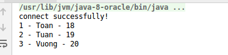
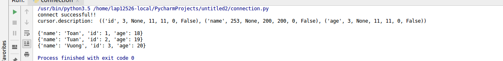

# MySQL overview
### ACID 
ACID là từ viết tắt các chữ cái đầu của bốn từ tiếng Anh atomicity, consistency, isolation, và durability. Chúng được coi là bốn thuộc tính quan trọng của một hệ quản trị cơ sở dữ liệu khi xử lý bất kỳ giao dịch nào. Nếu thiếu một trong những thuộc tính này thì tính toàn vẹn của cơ sở dữ liệu khó có thể được đảm bảo. Trong một hệ quản trị cơ sở dư liệu, một giao dịch là một đơn vị logic thao tác trên dữ liệu, có thể bao gồm nhiều thao tác. Chẳng hạn việc chuyển tiền từ tài khoản này sang tài khoản khác là một giao dịch, bao gồm thao tác trừ tiền một tài khoản và cộng tiền vào tài khoản kia. Các tính chất ACID trong trường hợp này sẽ đảm bảo các giao dịch được thực hiện một cách đáng tin cậy:
- Atomicity là một đề xuất tất cả hoặc không có gì. Tính chất này đảm bảo rằng khi một giao dịch liên quan đến hai hay nhiều xử lý, hoặc là tất cả các xử lý được thực hiện hoặc không có xử lý được thực hiện.
- Consistency. Một giao dịch hoặc là sẽ tạo ra một trạng thái mới và hợp lệ cho dữ liệu, hoặc trong trường hợp có lỗi sẽ chuyển toàn bộ dữ liệu về trạng thái trước khi thực thi giao dịch.
- Isolation. Một giao dịch đang thực thi và chưa được xác nhận phải bảo đảm tách biệt khỏi các giao dịch khác.
- Durability. Dữ liệu được xác nhận sẽ được hệ thống lưu lại sao cho ngay cả trong trường hợp hỏng hóc hoặc có lỗi hệ thống, dữ liệu vẫn đảm bảo trong trạng thái chuẩn xác.

## 1. STORAGE ENGINE
### 1.1 MYISAM

***Đặc điểm***  

- full-text indexing
- compression.
- spatial functions (GIS)
- Không hỗ trợ transactions
- Không hỗ trợ row-level lock.

***Lưu trữ***

MyISAM lưu mỗi bảng dữ liệu trên 2 file: .MYD cho dữ liệu và .MYI cho chỉ mục. Row có 2 loại: dynamic và static (tuỳ thuộc bạn có dữ liệu thay đổi độ dài hay không). Số lượng row tối đa có thể lưu trữ bị giới hạn bởi hệ điều hành, dung lượng đĩa cứng. MyISAM mặc định sử dụng con trỏ độ dài 6 bytes để trỏ tới bản ghi dữ liệu, do vậy giới hạn kích thước dữ liệu xuống 256TB. 


***Tính năng***

- MyISAM lock toàn bộ table. User (MySQL server) chiếm shared-lock khi đọc và chiếm exclusive-lock khi ghi. Tuy vậy, việc đọc ghi có thể diễn ra đồng thời!
- MyISAM có khả năng tự sửa chữa và phục hồi dữ liệu sau khi hệ thống crashed.
- Dùng command check table / repair table để kiểm tra lỗi và phục hồi sau khi bị lỗi.
- MyISAM có thể đánh chỉ mục full-text, hỗ trợ tìm kiếm full-text.
- MyISAM không ghi dữ liệu ngay vào ổ đĩa cứng, mà ghi vào 1 buffer trên memory (và chỉ ghi vào đĩa cứng sau 1 khoảng thời gian), do đó tăng tốc độ ghi. Tuy vậy, sau khi server crash, ta cần phải phục hồi dữ liệu bị hư hỏng bằng myisamchk.
- MyISAM hỗ trợ nén dữ liệu, hỗ trợ tăng tốc độ đọc dữ liệu. Mặc dù vậy dữ liệu sau khi nén không thể cập nhật được.

***Ưu điểm***

- Engine duy nhất hỗ trợ Full Text Search lập chỉ mục toàn văn, cung cấp thuật toán tìm kiếm khá giống Google
- Kiến trúc đơn giản nên có tốc độ truy suất (đọc và tìm kiếm) nhanh nhất trong các loại storage engine.

***Nhược điểm***

- MyISAM hoạt động theo cơ chế Table Level Locking, nên khi có hành động thực hiện (thêm/sửa/xóa) 1 bản ghi nào đó trong table thì table đó sẽ bị khóa lại, chờ tới khi hành động này thực hiện xong thì hành động kia mới được tiếp tục thực hiện.
- Kiến trúc đơn giản, không ràng buộc nên loại storage engine này rất hay dễ bị crash, hỏng chỉ mục với những Table có số lượng record lớn.

### 1.2 InnoDB

***Đặc điểm***  

- Là engine phức tạp nhất trong các engine của MySQL
- Hỗ trợ transactions
- Hỗ trợ phục hồi, sửa chữa tốt

***Lưu trữ***

InnoDB lưu dữ liệu trên 1 file (thuật ngữ gọi là tablespace).

***Tính năng***

- InnoDB hỗ trợ MVCC (Multiversion Concurrency Control) để cải thiện việc truy cập đồng thời và hỗ trợ chiến thuật next-key locking.
- InnoDB được xây dựng dựa trên clustered index, do đó việc tìm kiếm theo primary key có hiệu năng rất cao. InnoDB không hỗ trợ sắp xếp index do vậy việc thay đổi cấu trúc bảng sẽ dẫn tới toàn bộ dữ liệu phải được đánh chỉ mục từ đầu (CHẬM với những bảng lớn).

***Ưu điểm***

- Engine này kiểm tra tính toàn vẹn và ràng buộc dữ liệu rất cao khó xảy ra tình trạng hỏng chỉ mục và crash table.
- Hoạt động theo cơ chế Row Level Locking, vì vậy trong lúc thực hiện các hành động (thêm/sửa/xóa) trên một bản ghi, thì các hoạt động ở bản ghi khác trên table vẫn diễn ra bình thường
- Hỗ trợ Transaction giúp đảm bảo an toàn khi thực hiện một khối lệnh SQL đảm bảo nhất quán dữ liệu
- Phù hợp với các ứng dụng yêu cầu tính ổn định và toàn vẹn cao như ngân hàng, 

***Nhược điểm***

- Hoạt động cần nhiều RAM hơn nhưng nếu so sánh với MyISAM trong trường hợp tần suất Insert/Update/Delete lớn thì có khi sẽ lớn hơn vì cơ chế Table Level Locking sẽ gây ra hàng đợi lớn, gây chậm quá trình xử lý hệ thống.

### 1.3 Memory

***Đặc điểm***  

- Còn được gọi là HEAP tables.

***Lưu trữ***

Tất cả dữ liệu đều nằm trên memory.

***Tính năng***

- Sau khi server restart, cấu trúc bảng được bảo toàn, dữ liệu bị mất hết.
- Memory engine sử dụng HASH index nên rất nhanh cho query lookup.
- Memory engine dùng table-level locking do vậy tính concurrency không cao.

***Ưu điểm***

- Lưu trữ trên RAM, nên tốc độ truy xuất và cập nhật cực nhanh.

***Nhược điểm***

- Vì lưu trữ trên RAM, nên sau khi khởi động lại dịch vụ MySQL thì toàn bộ dữ liệu của table này sẽ bị xóa sạch. Vì vậy website của bạn thường thấy trả về 0 online sau khi bị restart server là vì vậy.
- Sử dụng cơ chế Table Level Locking như MyISAM nên trường hợp tần suất insert/update/delete cao có thể gây nghẽn cổ chai. Nếu xét về lưu trữ trên RAM vì vậy hiệu suất sẽ vẫn luôn tốt hơn MyISAM.

### 1.4 Archive

***Đặc điểm***  

- Chỉ hỗ trợ Insert và Select.
- Không đánh chỉ mục
- Dữ liệu được buffer và nén bằng zlib nên tốn ít I/O, tốc độ ghi do đó cao.
***Tính năng***

- Tốc độ ghi cao, phù hợp cho ứng dụng log.

### 1.5 CSV

***Đặc điểm***  

- Coi file CSV như là 1 table.
- Không hỗ trợ đánh chỉ mục

***Tính năng***

- Nếu bài toán là trích xuất thông tin từ file CSV và ghi vào cơ sở dữ liệu, đồng thời cần kết quả CSV ngay từ DB, engine này có vẻ thích hợp.

### 1.6 Falcon

***Đặc điểm***  

- Được thiết kế cho phần cứng hiện đại: server 64 bit, bộ nhớ “thênh thang”
- Vẫn còn khá mới, chưa có nhiều usercase

### 1.7 Maria

***Đặc điểm***  

- Được thiết kế bởi những chiến tướng dày dạn kinh nghiêm của MySQL, với mục đích thay thế MyISAM
- Hỗ trợ transactions theo lựa chọn
- Khôi phục lỗi
- Row-level locking và MVCC
- Hỗ trợ BLOB tốt hơn.

## 2. Installation
### 2.1 Cài đặt MySQL server
    sudo apt-get update
    sudo apt-get install mysql-server
    sudo ufw allow mysql
    systemctl start mysql
    mysql -u root -p

### 2.2 Thao tác với MySQL
    CREATE USER 'myuser'@'localhost' IDENTIFIED BY 'xxxx' // Tạo user

    alter user 'root'@'localhost' identified by 'xxxx'; // change password

    GRANT ALL ON *.* TO 'myuser'@'localhost' // phân quyền

    create database if not exists dbname    // Tạo database

    drop database if exists dbname;     // drop db

    show databases;    // Show list database 

    use dbanme;         // chọn DB

    create table class101 (id int, name varchar(50), gpa float); // Tạo table

    show tables; // Show list table

    describe class101; // show thông tin table

    insert into class101 values (11, 'Tan Ah Teck', 4.8); //insert record

    select * from class101; // select

    update class101 set gpa = 4.4 where name = 'Tan Ah Teck'; //update

    delete from class101 where id = 22; //delete

    ALTER TABLE contacts
    ADD last_name varchar(40) NOT NULL
    AFTER contact_id; // add new column

    ALTER TABLE contacts
    ADD last_name varchar(40) NOT NULL
    AFTER contact_id,
    ADD first_name varchar(35) NULL
    AFTER last_name;  // add multi column

    ALTER TABLE contacts
     MODIFY last_name varchar(55) NULL
    AFTER contact_type,
     MODIFY first_name varchar(30) NOT NULL; // change column

    ALTER TABLE table_name
    DROP COLUMN column_name; // drop column

    ALTER TABLE contacts
    CHANGE COLUMN contact_type ctype
    varchar(20) NOT NULL; // Rename column

    ALTER TABLE table_name
    RENAME TO new_table_name; //rename table

## 3. Data types
    
### Numberic
Type | Mô tả
--- | ---  
TINYINT(size) |	Lưu trữ một số nguyên có giá trị từ -128 đến -127 hoặc 0 đến 255
SMALLINT(size) | Lưu trữ một số nguyên có giá trị từ -32768 đến 32767 hoặc 0 đến 65535
MEDIUMINT(size)|	Lưu trữ một số nguyên có giá trị từ -8388608 đến 8388607 hoặc 0 đến 16777215
INT(size) |	Lưu trữ một số nguyên có giá trị từ -2147483648 đến 2147483647 hoặc 0 đến 4294967295
BIGINT(size) |	Lưu trữ một số nguyên có giá trị từ -9223372036854775808 đến 9223372036854775807 hoặc 0 đến 18446744073709551615.
FLOAT(size,d) | Lưu trữ một số thập phân loại nhỏ (Ví dụ: 567.25). Tham số “size” dùng để xác định kích thước tối đa của phần nguyên (nằm bên trái dấu chấm). Tham số “d” dùng để xác định kích thước tối đa của phần thập phân (nằm bên phải dấu chấm).
DOUBLE(size,d) | Lưu trữ một số thập phân loại lớn. Tham số “size” dùng để xác định kích thước tối đa của phần nguyên (nằm bên trái dấu chấm). Tham số “d” dùng để xác định kích thước tối đa của phần thập phân (nằm bên phải dấu chấm).
DECIMAL(size,d) |	Lưu trữ như một chuỗi, cho phép một dấu thập phân cố định. Tham số “size” dùng để xác định kích thước tối đa của phần nguyên (nằm bên trái dấu chấm). Tham số “d” dùng để xác định kích thước tối đa của phần thập phân (nằm bên phải dấu chấm).

### String
Type | Mô tả
--- | ---  
CHAR(size)| Dùng để lưu trữ một chuỗi ký tự có chiều dài tối đa là 255 ký tự
VARCHAR(size) | Dùng để lưu trữ một chuỗi ký tự có chiều dài tối đa là 255 ký tự. Nếu đặt “size” lớn hơn 255 thì nó sẽ chuyển sang kiểu TEXT
TINYTEXT | Dùng để lưu trữ một chuỗi ký tự có chiều dài tối đa là 255 ký tự
TEXT | Dùng để lưu trữ một chuỗi ký tự có chiều dài tối đa là 65,535 ký tự
BLOB | Dùng để lưu trữ dữ liệu nhị phân tối đa là 65,535 byte
MEDIUMTEXT | Dùng để lưu trữ một chuỗi ký tự có chiều dài tối đa là 16,777,215 ký tự
MEDIUMBLOB | Dùng để lưu trữ dữ liệu nhị phân tối đa là 16,777,215 byte
LONGTEXT | Dùng để lưu trữ một chuỗi ký tự có chiều dài tối đa là 4,294,967,295 ký tự
LONGBLOB | Dùng để lưu trữ dữ liệu nhị phân tối đa là 4,294,967,295 byte

### Datatime
Type | Mô tả
--- | --- 
DATE() | Lưu trữ một ngày theo định dạng YYYY-MM-DD (Ví dụ: 2016-09-12 tức là lưu ngày 12 tháng 9 năm 2016)
TIME() | Lưu trữ thời gian theo định dạng HH:MI:SS (Ví dụ 17:25:36 tức là lưu 17 giờ 25 phút 36 giây)
YEAR() | Lưu trữ một năm theo định dạng hai số hoặc bốn số
DATETIME() | Lưu trữ một ngày cùng với thời gian theo định dạng YYYY-MM-DD HH:MI:SS ,phạm vi '1000-01-01 00:00:00' to '9999-12-31 23:59:59'.
TIMESTAMP | Lưu trữ cả hai thông tin ngày tháng và thời gian. Giá trị này sẽ được chuyển đổi từ múi giờ hiện tại sang UTC trong khi lưu trữ, và sẽ chuyển trở lại múi giờ hiện tại khi lấy dữ liệu ra. Định dạng YYYY-MM-DD HH:MM:SS, phạm vi '1970-01-01 00:00:01' UTC to '2038-01-19 03:14:07' UTC

### utf8mb4
Bảng mã mỗi ký tự tối đa 4 byte, thay vì 3 byte của utf8, ví dụ 
- Switching from MySQL’s utf8 to utf8mb4
Step 1: Create a backup
Step 2: Upgrade the MySQL server
Step 3: Modify databases, tables, and columns
# For each database:
ALTER DATABASE database_name CHARACTER SET = utf8mb4 COLLATE = utf8mb4_unicode_ci;
# For each table:
ALTER TABLE table_name CONVERT TO CHARACTER SET utf8mb4 COLLATE utf8mb4_unicode_ci;
# For each column:
ALTER TABLE table_name CHANGE column_name column_name VARCHAR(191) CHARACTER SET utf8mb4 COLLATE utf8mb4_unicode_ci;
Step 4: Check the maximum length of columns and index keys
Step 5: Modify connection, client, and server character sets
[client]
default-character-set = utf8mb4

[mysql]
default-character-set = utf8mb4

[mysqld]
character-set-client-handshake = FALSE
character-set-server = utf8mb4
collation-server = utf8mb4_unicode_ci
Step 6: Repair and optimize all tables
REPAIR TABLE table_name;
OPTIMIZE TABLE table_name;

## 4. Transaction
### Khái niệm Transaction
Có thể hiểu Transaction là một tiến trình xử lý có xác định điểm đầu và điểm cuối, được chia nhỏ thành các operation (phép thực thi) , tiến trình được thực thi một cách tuần tự và độc lập các operation đó theo nguyên tắc hoặc tất cả đều thành công hoặc một operation thất bại thì toàn bộ tiến trình thất bại. Nếu việc thực thi một operation nào đó bị fail đồng nghĩa với việc dữ liệu phải rollback về trạng thái ban đầu.

### Cách sử dụng
```SQL
BEGIN TRY
    BEGIN TRAN T
        INSERT INTO QuaTrinhMuon(isbn,ma_cuonsach,ngayGio_muon,ma_docgia,ngay_hethan,ngayGio_tra,tien_muon) 
        VALUES(@ISBN,@MACS,@NGAYMUON,@MADG,@NGAYHETHAN,GETDATE(),@TIENPHAT)
        DELETE Muon WHERE isbn=@ISBN AND ma_docgia=@MADG
    COMMIT TRAN T
END TRY
BEGIN CATCH 
    ROLLBACK T
END CATCH
```

### Khi gặp lỗi trong transaction
Nếu bị lỗi, thì lệnh ROLLBACK nên được đưa ra để đưa tất cả các table liên quan với transaction về lại trạng thái trước đó. Ta có thể điều khiển hành vi của một transaction bằng cách thiết lập một biến phiên, được gọi là Autocommit. Nếu Autocommit được thiết lập bằng 1, SET AUTOCOMMIT = 1 (default), thì mỗi lệnh SQL (trong hoặc ngoài transaction) được xem như một transaction hoàn chỉnh, điều này được duy trì cho đến khi nó kết thúc. Khi Autocommit được thiết lập bằng 0, SET AUTOCOMMIT = 0, thì một tập, có thứ tự, của các câu lệnh sẽ đóng vai trò như là một transaction và không có một hoạt động nào là được xuất phát cho đến có một lệnh Commit khác được đưa ra. Ta có thể sử dụng các câu lệnh này trong PHP bằng cách sử dụng hàm mysql_query().   
***Statements không thể rollback: DDL ví dụ tạo hoặc xóa database, tạo xóa chỉnh sửa table.***

### Statement ngầm định tự commit khi kết thúc
- Data definition language (DDL) statements that define or modify database objects: ALTER EVENT, ALTER FUNCTION, ALTER PROCEDURE, ALTER SERVER, ALTER TABLE, ALTER VIEW, CREATE DATABASE, CREATE EVENT, CREATE FUNCTION, CREATE INDEX, CREATE PROCEDURE, CREATE ROLE, CREATE SERVER, CREATE SPATIAL REFERENCE SYSTEM, CREATE TABLE, CREATE TRIGGER, CREATE VIEW, DROP DATABASE, DROP EVENT, DROP FUNCTION, DROP INDEX, DROP PROCEDURE, DROP ROLE, DROP SERVER, DROP SPATIAL REFERENCE SYSTEM, DROP TABLE, DROP TRIGGER, DROP VIEW, INSTALL PLUGIN, RENAME TABLE, TRUNCATE TABLE, UNINSTALL PLUGIN.
- Statements that implicitly use or modify tables in the mysql database: . ALTER USER, CREATE USER, DROP USER, GRANT, RENAME USER, REVOKE, SET PASSWORD.
- Transaction-control and locking statements. BEGIN, LOCK TABLES, SET autocommit = 1 (if the value is not already 1), START TRANSACTION, UNLOCK TABLES.
- Data loading statements. LOAD DATA INFILE
- Administrative statements. ANALYZE TABLE, CACHE INDEX, CHECK TABLE, FLUSH, LOAD INDEX INTO CACHE, OPTIMIZE TABLE, REPAIR TABLE, RESET (but not RESET PERSIST).
- Replication control statements. START SLAVE, STOP SLAVE, RESET SLAVE, CHANGE MASTER TO.

### SAVEPOINT

```SQL
SAVEPOINT identifier
ROLLBACK [WORK] TO [SAVEPOINT] identifier
RELEASE SAVEPOINT identifier    // remove savepoint name identifier
```

### LOCK INSTANCE FOR BACKUP
Ngăn cản việc create, rename, remove trong tran
### LOCK TABLE 
```SQL
SET autocommit=0;
LOCK TABLES t1 WRITE, t2 READ, ...;
... do something with tables t1 and t2 here ...
COMMIT;
UNLOCK TABLES;
```

## 5. ISOLATION

### 5.1 Các lỗi có thể xảy ra khi truy xuất đồng thời
***Mất dữ liệu cập nhật(Lost update)***

    Tình trạng này xảy ra khi có nhiều hơn một giao tác cùng thực hiện cập nhật trên 1 đơn vị dữ liệu. Khi đó, tác dụng của giao tác cập nhật thực hiện sau sẽ đè lên tác dụng của thao tác cập nhật trước.

***Đọc dữ liệu chưa commit (Uncommitted data, Dirty read)***
    
    Xảy ra khi một giao tác thực hiện đọc trên một đơn vị dữ liệu mà đơn vị dữ liệu này đang bị cập nhật bởi một giao tác khác nhưng việc cập nhật chưa được xác nhận.

***Giao tác đọc không thể lặp lại (Unrepeatable data)***

    Tình trạng này xảy ra khi một giao tác T1 vừa thực hiện xong thao tác đọc trên một đơn vị dữ liệu (nhưng chưa commit) thì giao tác khác (T2) lại thay đổi (ghi) trên đơn vị dữ liệu này. Điều này làm cho lần đọc sau đó của T1 không còn nhìn thấy dữ liệu ban đầu nữa.

***Bóng ma (Phantom)***
    
    Là tình trạng mà một giao tác đang thao tác trên một tập dữ liệu nhưng giao tác khác lại chèn thêm các dòng dữ liệu vào tập dữ liệu mà giao tác kia quan tâm.
### 5.2 Các mức cô lập

#### 5.2.1. Read Uncommitted

***Đặc điểm***

- Không thiết lập Shared Lock trên những đơn vị dữ liệu cần đọc.
Do đó không phải chờ khi đọc dữ liệu (kể cả khi dữ liệu đang bị
lock bởi giao tác khác).
- ( Vẫn tạo Exclusive Lock trên đơn vị dữ liệu được ghi, Exclusive
Lock được giữ cho đến hết giao tác).

***Ưu điểm***

- Tốc độ xử lý rất nhanh.
- Không cản trở những giao tác khác thực hiện việc cập nhật dữ
liệu.

***Khuyết điểm***

Có khả năng xảy ra mọi vấn đề khi xử lý đồng thời :
- Dirty Reads
- Unrepeatable Reads
- Phantoms
- Lost Updates


#### 5.2.2. Read Committed

***Đặc điểm***

- Đây là mức độ cô lập mặc định của SQL Server

- Tạo Shared Lock trên đơn vị dữ liệu được đọc, Shared Lock
được giải phóng ngay sau khi đọc xong dữ liệu

- Tạo Exclusive Lock trên đơn vị dữ liệu được ghi, Exclusive Lock
được giữ cho đến hết giao tác

***Ưu điểm***

- Giải quyết vấn đề Dirty Reads

- Shared Lock được giải phóng ngay, không cần phải giữ cho đến
hết giao tác nên không cản trở nhiều đến thao tác cập nhật của
các giao tác khác.

***Khuyết điểm***

- Chưa giải quyết được vấn đề Unrepeatable Reads, Phantoms,
Lost Updates

- Phải chờ nếu đơn vị dữ liệu cần đọc đang được giữ khoá ghi
(xlock)

#### 5.2.3. Repeatable Read

***Đặc điểm***

- Tạo Shared Lock trên đơn vị dữ liệu được đọc và giữ shared lock
này đến hết giao tác => Các giao tác khác phải chờ đến khi giao
tác này kết thúc nếu muốn cập nhật, thay đổi giá trị trên đơn vị
dữ liệu này.

- (Repeatable Read = Read Committed + Giải quyết Unrepeatable
Reads)

- Tạo Exclusive Lock trên đơn vị dữ liệu được ghi, Exclusive Lock
được giữ cho đến hết giao tác.

***Ưu điểm***

- Giải quyết vấn đề Dirty Reads và Unrepeatable Reads

***Khuyết điểm***

- Chưa giải quyết được vấn đề Phantoms, do vẫn cho phép insert
những dòng dữ liệu thỏa điều kiện thiết lập shared lock

- Phải chờ nếu đơn vị dữ liệu cần đọc đang được giữ khoá ghi
(xlock)

- Shared lock được giữ đến hết giao tác ==> cản trở việc cập nhật
dữ liệu của các giao tác khác

#### 5.2.4. Serializable

***Đặc điểm***

- Tạo Shared Lock trên đơn vị dữ liệu được đọc và giữ shared lock
này đến hết giao tác => Các giao tác khác phải chờ đến khi giao
tác này kết thúc nếu muốn cập nhật, thay đổi giá trị trên đơn vị
dữ liệu này .

- Không cho phép Insert những dòng dữ liệu thỏa mãn điều kiện
thiết lập Shared Lock (sử dụng Key Range Lock) ==>
Serializable = Repeatable Read + Giải quyết Phantoms

- Tạo Exclusive Lock trên đơn vị dữ liệu được ghi, Exclusive Lock
được giữ cho đến hết giao tác.

***Ưu điểm***

- Giải quyết thêm được vấn đề Phantoms

***Khuyết điểm***

- Phải chờ nếu đơn vị dữ liệu cần đọc đang được giữ khoá ghi
(xlock)

- Cản trở nhiều đến việc cập nhật dữ liệu của các giao tác khác

## Connector
### JDBC

#### Tạo database
```sql
CREATE DATABASE connectMySQL;
USE connectMySQL;
CREATE TABLE people (
    id   INT	NOT NULL,
    name VARCHAR (50)	NOT NULL,
    age  INT	NOT NULL,
    PRIMARY KEY (id)
);

INSERT INTO people VALUES (1, "Toan", 18);
INSERT INTO people VALUES (2, "Tuan", 19);
INSERT INTO people VALUES (3, "Vuong", 20);
```

#### Tạo project java và add dependency
```
<dependency>
    <groupId>mysql</groupId>
    <artifactId>mysql-connector-java</artifactId>
    <version>5.1.6</version>
</dependency>
```

#### Code ví dụ và kết quả
```java
package testConnectMysql;
import com.mysql.jdbc.*;
import java.sql.DriverManager;
import java.sql.ResultSet;

public class App
{
    private static String DB_URL = "jdbc:mysql://localhost:3306/connectMySQL";
    private static String USER_NAME = "root";
    private static String PASSWORD = "admin";

    public static void main( String[] args )
    {
        try {
            Connection conn = getConnection(DB_URL, USER_NAME, PASSWORD);
            Statement stmt = (Statement) conn.createStatement();
            ResultSet rs = stmt.executeQuery("select * from people");
            while (rs.next()) {
                System.out.println(rs.getInt(1) + " - " + rs.getString(2)
                        + " - " + rs.getInt(3));
            }
            conn.close();
        } catch (Exception ex) {
            ex.printStackTrace();
        }

    }

    public static Connection getConnection(String dbURL, String userName, String password) {
        Connection conn = null;
        try {
            Class.forName("com.mysql.jdbc.Driver");
            conn = (Connection) DriverManager.getConnection(dbURL, userName, password);
            System.out.println("connect successfully!");
        } catch (Exception ex) {
            System.out.println("connect failure!");
            ex.printStackTrace();
        }
        return conn;
    }

}
```

Kết quả
<div style="text-align: center">
    
</div>

### PyMySQL
#### install 

#### Code và kết quả

```python
import pymysql.cursors

connection = pymysql.connect(host='localhost',
                             user='root',
                             password='admin',
                             db='connectMySQL',
                             cursorclass=pymysql.cursors.DictCursor)

print("connect successful!!")

try:
    with connection.cursor() as cursor:
        sql = "SELECT * FROM people "
        cursor.execute(sql)
        print("cursor.description: ", cursor.description)
        print()
        for row in cursor:
            print(row)
finally:
    connection.close()
```

kết quả
<div style="text-align: center">
    
</div>


