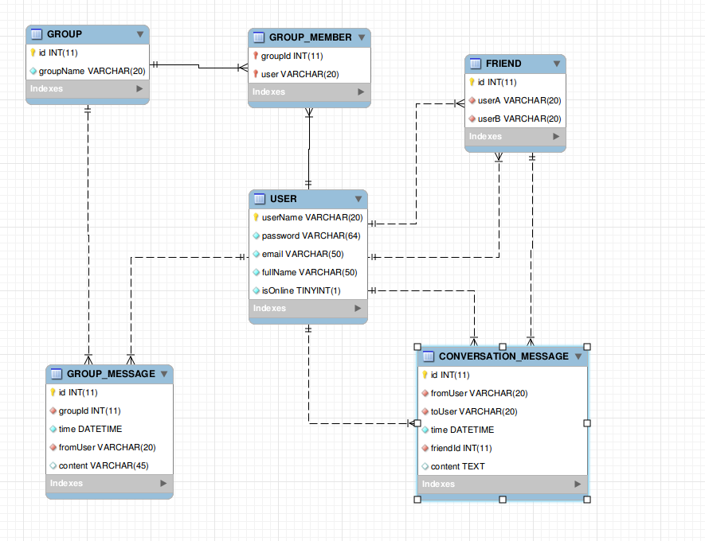

# Database thinking
##  Bài tập 

Thiết kế schema cho chương trình chat - trò chuyện (với Redis và với MySQL), sử dụng Python để tương tác.

Mô tả chương trình chat: cơ chế tương tự Zalo, Message. 

### 1. Cơ bản:

- Tạo tài khoản (username/password, email,...)
- Chọn người trò chuyện (theo username hoặc email)
- Hiển thị lịch sử trò chuyện (nếu có)
- Trò chuyện (chat)

### 2. Nâng cao:

- Kết bạn
- Chat trong nhóm
- Hiển thị trạng thái online/offline của người khác
- Hiện thị trạng thái tin nhắn (seen)

## Sơ đồ schema MySQL

    

Dùng redis:

| key  | value | desription |
|---|---| --- |
| `friend.${id}.latedmsg` | 1  |  lưu id tin nhắn cuối cùng của 1vs1 | 
| `friend.${id}.${userA}.read` | 1  | Lưu id tin nhắn cuối cùng của User A đọc |
| `friend.${id}.${userB}.read` | 1 | Lưu id tin nhắn cuối cùng của user B đọc|
| `group.${id}.${userA}.read` | 1 | Lưu id tin nhắn cuối cùng  của user A đọc trong group |
| `group.${id}.${userB}.read` | 1 | Lưu id tin nhắn cuối cùng  của user B đọc trong group |
| `group.${id}.${userC}.read` | 1 | Lưu id tin nhắn cuối cùng  của user C đọc trong group |
