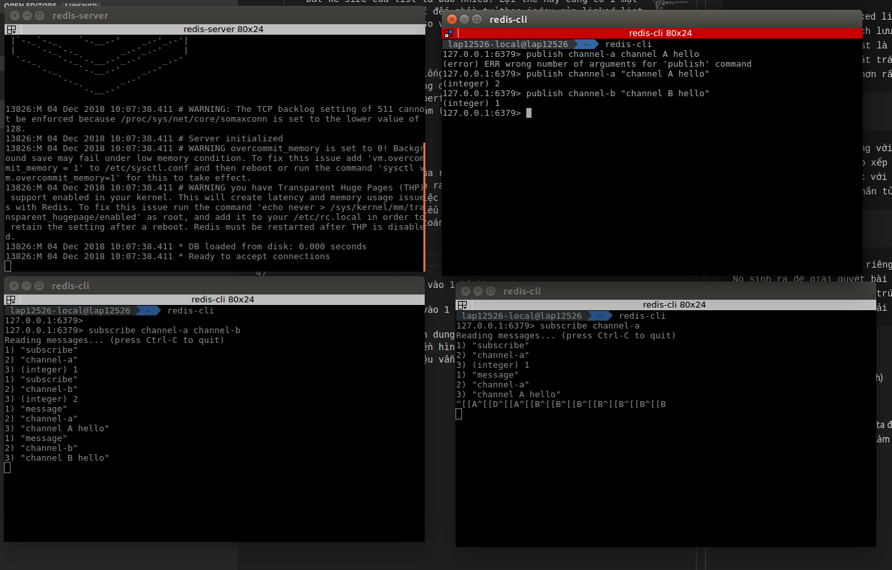

# Redis 
## 0. Version
Redis sử dụng một cách thức tiêu chuẩn cho các phiên bản của nó: major.minor.patchlevel. Một minor mark cũng có thể là một phiên bản ổn định, như 1.2, 2.0, 2.2, 2.4, 2.6, 2.8. Các phiên bản lẻ được sử dụng cho các bản phát hành không ổn định như phiên bản 2.9.x là phiên bản không ổn định của Redis 3.0 ổn định

**Redis 4.0** đã được phát hành dưới dạng GA vào tháng 7 năm 2017, những người mới nên sử dụng Redis 5, nhưng Redis 4 hiện là phiên bản được chứng minh sản xuất nhiều nhất và sẽ được cập nhật cho năm tiếp theo cho đến khi Redis 6 sẽ ra mắt. Nó chứa một số cải tiến lớn: hệ thống mô-đun, sao chép tốt hơn nhiều (PSYNC2), cải tiến chính sách trục xuất, luồng DEL / FLUSH, định dạng RDB + AOF hỗn hợp, hỗ trợ Raspberry Pi làm nền tảng chính, lệnh MEMORY mới, hỗ trợ Redis Cluster cho Nat / Docker, chống phân mảnh bộ nhớ hoạt động, sử dụng bộ nhớ và cải thiện hiệu suất, tạo khóa Redis Cluster nhanh hơn nhiều, nhiều tính năng nhỏ hơn khác và một số hành vi được sửa

**Redis 5.0** là phiên bản đầu tiên của Redis giới thiệu kiểu dữ liệu luồng mới với nhóm người tiêu dùng, bộ sắp xếp chặn hoạt động pop, thông tin LFU / LRU trong RDB, Trình quản lý cụm bên trong redis-cli, phân mảnh hoạt động V2, cải tiến HyperLogLog và nhiều cải tiến khác. Redis 5 được phát hành dưới dạng GA vào tháng 10 năm 2018.
## 1. Installation
    wget http://download.redis.io/redis-stable.tar.gz
    tar xvzf redis-stable.tar.gz
    cd redis-stable
    make
    //Run server
    redis-server

### Cài đặt Redis cluster
config node:

    port 7000
    cluster-enabled yes
    cluster-config-file nodes.conf
    cluster-node-timeout 5000
    appendonly yes

../redis-server ./redis.conf

redis-cli --cluster create 127.0.0.1:7000 127.0.0.1:7001 \
127.0.0.1:7002 127.0.0.1:7003 127.0.0.1:7004 127.0.0.1:7005 \
--cluster-replicas 1

## 2. Data types

### 2.1 Strings
    String là kiểu dữ liệu cơ bản nhất của Redis và đây cũng là kiểu dữ liệu duy nhất của Memcache. Có 3 câu lệnh cơ bản với String đó là GET, SET và DEL.

### 2.2 Hash
    HASH lưu trữ tập các map của key và value. Key vẫn là string, còn value có thể là string hoặc số. 

### 2.3 Lists
    List trong Redis là linked list, lưu trữ 1 danh sách có thứ tự (trước sau) của các string. Cách lưu trữ này giúp cho thời gian add thêm 1 phần tử vào đầu hoặc cuối list là hằng số, bất kể size của list là bao nhiêu. Lợi thế này cũng có 1 mặt trái là việc truy xuất đến phần tử theo index của linked list là lâu hơn rất nhiều so với array.

### 2.4 Sets
    Set trong Redis khá giống với list, nhưng khác 1 điều là các phần tử trong set không được sắp xếp theo thứ tự nào cả. Tuy nhiên, Redis đã tăng performance khi làm việc với set bằng cách sử dụng 1 bảng băm (hash table) để lưu trữ các phần tử của set.

### 2.5 Sorted Sets
    Đây là kiểu dữ liệu của riêng Redis, và có thể nói là chưa thấy ở đâu cả. Nó sinh ra để giải quyết bài toán sắp xếp rất rất hay gặp khi làm việc với các hệ thống web. Cấu trúc của zset phức tạp hơn 4 kiểu dữ liệu còn lại và nhớ đó nó có thể giải quyết nhiều bài toán khác nhau.

## 3. Pub/Sub

PUB: PUBLISH (Đẩy dữ liệu vào 1 kênh)

SUB:  SUBSCRIBE (Đăng kí vào 1 kênh)

Nếu hiểu đơn giản thì hình dung như ta đăng kí vào 1 kênh truyền hình nào đó, khi đài truyền hình đẩy về kênh đó các dữ liệu, ta không cần làm gì cả dữ liệu vẫn luôn được tự cập nhật.

Ví dụ: 

    

## Lock

    Locking là một cơ chế RDBMS ngăn chặn người dùng từ nhiều transactions khác nhau gây ra data conflicts. Locking một row giúp ngăn chặn các transactions khác thay đổi row đó cho đến khi transaction đang truy cập vào nó kết thúc. Trong đó có 2 chiến lược lock là: optimistic và pesimistic. 

### Pessimistic Locking

- Cơ chế này hoạt động bằng cách lock một row trước khi một attribute của nó được thay đổi thông qua việc gọi đến method setAttribute(). Nếu có bất kì transaction khác cố gắng truy cập vào row đã bị khóa đó, chúng sẽ bị buộc phải chờ cho đến khi transaction đầu tiên hoàn thành. 

- Pessimistic locking là cơ chế locking an toàn nhất bởi việc hai transactions sẽ không bao giờ có thể cùng thay đổi một row. Tuy nhiên, chiến lược locking này có một vài nhược điểm như sau:
    - Nếu một user chọn edit một record, sau đó, anh ra đi ăn trưa mà chưa kết thúc hay hủy bỏ transaction này. Khi đó, tất cả các users khác cần update record này sẽ buộc phải đợi cho đến khi anh ta trở lại và hoàn thành transaction, hoặc cho đến khi DBA kill transaction này và mở locking.

    - Có thể xảy ra Deadlock. Khi User A và B cùng update vào Database trong cùng một thời gian. User A sẽ khóa lại record đó và cố gắng mở khóa được hình thành bởi User B cũng đang đợi mở khóa mà User A vừa hình thành.

### Optimistic Locking

Optimistic Locking cho phép nhiều giao dịch có thể hoàn thành mà không ảnh hưởng đến nhau. Oracle đã khuyến cáo việc sử dụng Optimistic Locking cho các ứng dụng web. Thay vì khóa một row ngay khi nó được thay đổi, với Optimistic Locking, BC4J chờ đợi cho đến khi row thay đổi được posted trước khi cố gắng để có được một khóa. Một exception sẽ không được throw cho đến khi các giao dịch conflict cố gắng post các thay đổi của chúng vào cơ sở dữ liệu.

Ví dụ về Optimistic Locking, giả sử user1 và user2 là hai người dùng khác nhau (hai giao dịch riêng biệt) bằng cách sử dụng Optimistic Locking, cả hai đều cố gắng thay đổi cùng một dãy dữ liệu như sau:

    - User1 call EmployeesImpl.setSalary (1000) trên một row cụ thể, user1 không ngay lập tức có được một khóa trên hàng đó.
    - User2 call EmployeesImpl.setSalary (2000) trên một row tương tự. User1 và User2 hiện có bộ nhớ cache entity khác nhau cho cùng một row.
    - User 2 call commit() action, như một phần của cycle commit, row đã thay đổi được post lên cơ sở dữ liệu. Trước khi hành động update có thể được thực hiện, User 2 đã có được khóa trên row đó. Khóa sẽ hết hạn ngay lập tức, khi lệnh commit được gửi tới cơ sở dữ liệu.
    - User 1 bây giờ call commit() action, BC4J cố gắng gửi row đã được thay đổi tới cơ sở dữ liệu, ngay trước khi post nó, nó cố gắng để có được khóa trên row đó. BC4J nhận ra rằng row đã được thay đổi bởi người dùng khác và hành động update row sẽ overwrite lên các thay đổi khác của transaction, do đó, nó sẽ throw một oracle.jbo.RowInconsistentException.

##  Distributed lock **
Khi chúng ta xây dựng các hệ thống phân tán, chúng ta sẽ phải đối mặt với nhiều quy trình xử lý một tài nguyên chia sẻ với nhau, nó sẽ gây ra một số vấn đề không mong muốn do thực tế chỉ có một người trong số họ có thể sử dụng tài nguyên được chia sẻ cùng một lúc!
 
Chúng  ta có thể sử dụng Distributed lock để giải quyết vấn đề này.

Ba tiêu chí tối thiểu để sử dụng lock phân tán một cách hiệu quả:

    - Safety property: Loại trừ lẫn nhau. Tại bất kì thời điểm nào thì chỉ có duy nhất một client được phép giữ lock.
    - Liveness property A: Giải phóng deadlock. Một tài nguyên không được phép bị lock mãi mãi, ngay cả khi một client đã lock tài nguyên đó nhưng bị treo hoặc gặp sự cố.
    - Liveness property B: Tính chịu lỗi: Nếu phần lớn các node Redis vẫn đang hoạt động thì client vẫn có thể nhận và giải phóng lock.

### Thuật toán Redlock
Để nhận lock, một client thực hiện các thao tác sau:

    - Nhận thời gian hiện tại theo đơn vị mili giây.

    - Cố gắng tạo lock tuần tự trong tất cả N instance, sử dụng cùng một tên key và giá trị ngẫu nhiên cho tất cả instance. Trong suốt bước 2, khi thiết đặt lock trong mỗi instance, client sử dụng một timeout nhỏ hơn so với tổng thời gian tự động giải phóng lock để tạo lock. Ví dụ, nếu thời gian giải phóng lock tự động là 10 giây, thì timeout có thể nằm trong khoảng 5-50 ms. Việc này ngăn chặn client cố gắng kết nối với một Redis node bị treo trong một thời gian dài: nếu một instance không sẵn dùng, ta nên thử kết nối với instance tiếp theo càng sớm càng tốt.

    - Client sẽ phải tính toán xem bao nhiêu thời gian đã trôi qua để nhận được lock bằng cách sử dụng thời gian hiện tại đã lấy được từ bước 1. Nếu và chỉ nếu client nhận được lock trong phần lớn các instance (ít nhất là 3), và tổng thời gian trôi qua để có được lock ít hơn thời gian hiệu lực của lock, lock đó sẽ được nhận.

    - Nếu lock đã được nhận, thời gian hiệu lực thực sự của nó chính là thời gian hiệu lực khởi tạo ban đầu trừ đi thời gian trôi qua trong lúc tạo lock, như đã được tính trong bước 3.
    
    - Nếu client không thể nhận được lock vì một vài lí do (hoặc nó không thể tạo lock trên N/2 + 1 instance, hoặc thời gian hiệu lực là số âm), nó sẽ cố gắng unlock trên tất cả instance (ngay cả những instance mà nó cho rằng vẫn chưa tạo được lock).
