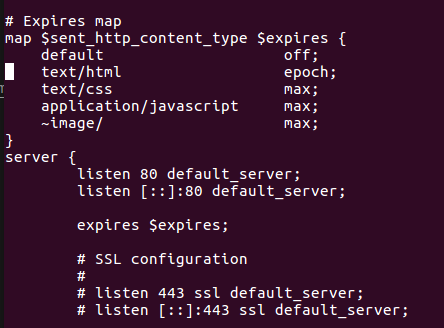
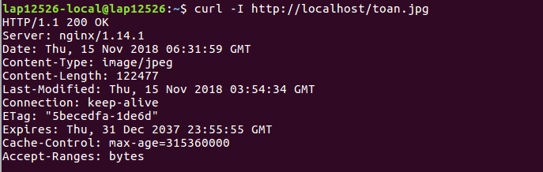

# Cache
## Vai trò của cache

    

- Caching cải thiện thời gian tải trang và có thể giảm tải trên máy chủ và cơ sở dữ liệu của bạn.
- Cơ sở dữ liệu thường được hưởng lợi từ việc phân phối đồng đều các lần đọc và ghi trên các phân vùng của nó. Các mục phổ biến có thể làm lệch phân phối, gây tắc nghẽn. Đặt bộ nhớ cache ở phía trước cơ sở dữ liệu có thể giúp hấp thụ tải không đồng đều và tăng đột biến về lưu lượng truy cập.

### Các loại caching
    - Client caching
    - CDN caching
    - Web server caching
    - Database caching
    - Application caching

## Các thuật toán apply cho cache

### Least recently used (LRU)
Thay thế những phần tử được gọi xa nhất tính tới thời điểm hiện tại.

    

### Least-frequently used (LFU)
Thay thế những phần tử có số lần gọi đến ít nhất.

    

## Bài tập
- Config file "sudo nano /etc/nginx/sites-available/default" 

    

- Run nginx: "sudo systemctl restart nginx"
- Kiểm tra: curl -I http://localhost/toan.jpg

    

### Tài liệu tham khảo
- [Cache](https://en.wikipedia.org/wiki/Cache_replacement_policies#Least_Recently_Used)
