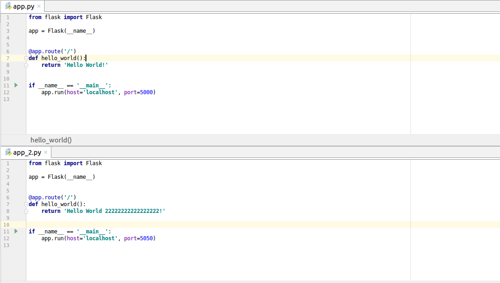

# Load balancer
-  Là một hệ thống(phần mềm , thiết bị ) phân phối các request tới server hoặc database của ứng dụng. Lợi ích của load balancer: 
    - Ngăn chặn các request đến một server "không khỏe". Nghĩa là nếu con server đó die thì load balancer sẽ điều hướng các request tới 1 con server khác cho đến khi con server này hoạt động trở lại.
    - Phân chia các request đến đều các server.
    - Loại bỏ 1 điểm bị hỏng.
- Load balancer có thể thực thi bằng phần cứng (đắt tiền) hoặc với phần mềm như HAProxy.
- Các lợi ích khác: 
    - SSL termination - giải mã các yêu cầu và mã hóa các phản hồi trả về của server giúp server không phải thực hiện hành động này
    - Session persistence - phát hành cookies và định tuyến các yêu cầu cụ thể của người dùng nếu ứng dụng web không theo dõi các session
- Load balancer có thể định tuyến lưu lượng truy cập dựa trên các số liệu khác nhau, bao gồm:
    - Random: Phân phối tải trọng đến các server một cách ngẫu nhiên. Chọn server thông qua hệ số ngẫu nhiên và gửi kết nối hiện thời đến cho nó.
    - Round robin: Round Robin chuyển mỗi yêu cầu kết nối mới tới server tiếp theo trong hệ thống, kết quả cuối cùng là phân phối kết nối đồng đều trên các server.
    - Weighted round robin: Mỗi server được đánh số một trọng số tỷ lệ, số lượng kết nối tới mỗi máy nhận được qua thời gian là tương ứng với tỷ lệ được xác định trên mỗi server.
    - Least loaded: Hệ thống chuyển một kết nối mới tới server mà có số lượng kết nối it nhất hiện thời.
- Layer 4 load balancing: xử lý dữ liệu tìm thấy trong các giao thức tầng mạng và giao vận (IP, TCP, FTP, UDP). Layer 4 load balancer quan tâm đến địa chỉ IP nguồn, đích và ports trong header mà không kiểm tra nội dung của các gói dữ liệu.
- Layer 7 load balancing: phân phối yêu cầu dựa trên dữ liệu tìm thấy trong tầng ứng dụng, lớp giao thức như HTTP.
Với chi phí linh hoạt, cân bằng tải lớp 4 đòi hỏi ít thời gian và tài nguyên máy tính hơn Lớp 7, mặc dù hiệu suất có thể thấp hơn đối với các thiết bị hiện đại.

# 2. Kiến trúc bên trong nginx
## 2.1 Khái niệm .hông dựa trên luồn (thread) để xử lý yêu cầu. Thay vào đó, nó sử dụng 1 kiến trúc bất đồng bộ hướng sự kiện linh hoạt . Kiến trúc này sử dụng ít, nhưng quan trọng hợn, là lượng bộ nhớ có thể dự đoán khi hoạt động.
## 2.2 Kiến trúc của Nginx
- Master process: thực thi những tác vụ như đọc config, binding ports, tạo một số lượng các process con. Cache loader process: process này chạy lúc khởi động để nạp bộ nhớ disk cache vào memory sau đó nó sẽ exit. Process này được lên kế hoạch trước, sử dụng ít tài nguyên hệ thống.

- Cache manager process: process chạy định kỳ, để giữ cho bộ nhớ disk cache luôn đúng kích thước như trong config.

- Worker process: là những process làm việc với connections, nó đọc và ghi nội dung vào disk, và giao tiếp với app server, handle request từ clients.

    

### ***Tại sao nginx dùng single thread?***
* Nginx dùng single-thread và chỉ có thể thực hiện một thao tác tại một thời điểm. Trên thực tế, một ứng dụng non-blocking single thread là thiết kế hiệu quả nhất cho một single process hardware. Khi chỉ có một cpu và ứng dụng hoàn toàn non-blocking thì có thể sử dụng tối đa hiệu suất cpu. ứng dụng non-blocking nghĩa là ứng dụng đó không gọi bất kì chức năng nào có thể chờ một event. Tất cả các IO operation đều không đồng bộ, Có nghĩa là khi ta gọi read() từ socket, cuộc gọi đó có thể đợi cho đến khi có dữ liệu. Vì vậy ứng dụng non-blocking tôt nhất cần 1 thread cho 1 cpu trong hệ thống. Như NGINX sử dụng non-blocking, việc xử lý trên nhiều thread sẽ không có ý nghĩa bởi không có cpu để thực thi các luồng thêm vào.   

# 3. Thí nghiệm
- Cài đặt 2 server chạy 2 port khác nhau

    

- config file "sudo nano /etc/nginx/sites-available/default"

    

- Kết quả

    

### Tài liệu tham khảo:
- [Nginx](https://viblo.asia/p/tim-hieu-va-huong-dan-setup-web-server-nginx-OREGwBwlvlN)