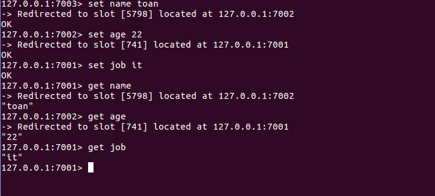
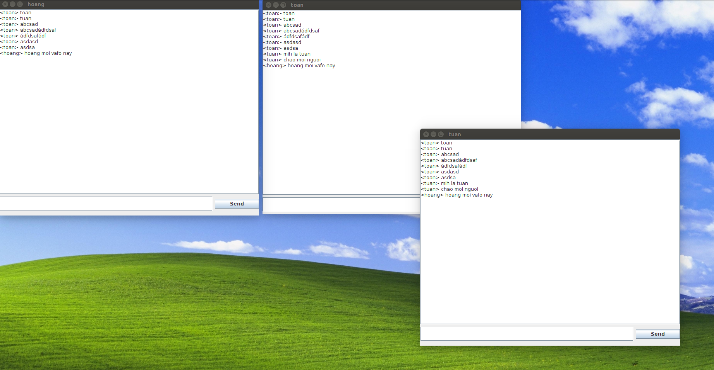

# Redis
## 1. Khái niệm
Redis là hệ thống lưu trữ key-value với nhiều tính năng và được sử dụng rộng rãi. Nổi bật bởi việc hỗ trợ nhiều cấu trúc dữ liệu cơ bản (hash, list, set, sortset, string) giúp việc thao tác với dữ liệu tốt hơn các hệ thống cũ như memcached rất nhiều. Bên cạnh lưu trữ key-value trên RAM giúp tối ưu performance, redis còn hỗ trợ lưu trữ dữ liệu trên đĩa cứng(persistent redis), cho phép phục hồi dữ liệu khi gặp sự cố. 

Redis persistence: Có 3 cách để làm redis liên tục tồn tại: RDB, AOF và SAVE.
  * RDB : RDB tạo một bản sao của tất cả dữ liệu trong bộ nhớ và lưu trữ chúng trong bộ nhớ thứ cấp (bộ nhớ vĩnh viễn). Điều này xảy ra trong một khoảng thời gian cụ thể.
  * AOF: AOF sẽ log lại mỗi khi có các tác vụ ghi mà Redis server nhận được, do đó mọi thứ sẽ được lưu trữ, đó là một công việc tốn kém chi phí và dung lượng dữ liệu AOF cũng lớn hơn dung lượng dữ liệu RDB.
  * SAVE: có thể bắt Redis server tạo ra một bản RDB snapshot mỗi lần sử dụng Redis console client qua SAVE command.

* Backup And Recovery Of Redis DataStore :
  * Redis không cung cấp cơ chế cho việc khôi phục dữ liệu.
  * Nếu ta sử dụng Redis theo cơ chế replicated, thì không cần việc backup.

- Redis Replication : Replicate là một kĩ thuật để kết nối nhiều máy tính với nhau để sao chép dữ liệu, khi có một máy tính bị mất dữ liệu thì dữ liệu vẫn còn nằm ở các máy khác.


## 2. Kiến trúc bên trong
* Kiến trúc Redis gồm 2 tiến trình chính: Redis Client và Redis Server

<div align="center">
    
</div>

* Redis client và Redis server có thể ở cùng một hoặc 2 máy khác nhau
* Redis server chịu trách nhiệm lưư trữ dữ liệu trong bộ nhớ. Xử lý tất cả các loại quản lý và tạo nên thành phần chính của kiến trúc. Redis client có thể là redis console client hoặc bất kì các ngôn ngữ lập trình Redis API nào khác.
* Redis lưu trữ mọi thứ trong primary memory. Primary memory thì dễ "bay hơi" vì thế dữ liệu sẽ bị mất đi khi khởi động lại Redis server hoặc máy tính. Vì vậy, cần một cách để lưu trữ dữ liệu.

## 3. Cấu trúc dữ liệu của Redis: 

### 3.1 Strings
    String là kiểu dữ liệu cơ bản nhất của Redis và đây cũng là kiểu dữ liệu duy nhất của Memcache. Có 3 câu lệnh cơ bản với String đó là GET, SET và DEL.

### 3.2 Hash
    HASH lưu trữ tập các map của key và value. Key vẫn là string, còn value có thể là string hoặc số. 

### 3.3 Lists
    List trong Redis là linked list, lưu trữ 1 danh sách có thứ tự (trước sau) của các string. Cách lưu trữ này giúp cho thời gian add thêm 1 phần tử vào đầu hoặc cuối list là hằng số, bất kể size của list là bao nhiêu. Lợi thế này cũng có 1 mặt trái là việc truy xuất đến phần tử theo index của linked list là lâu hơn rất nhiều so với array.


### 3.3 Sets
    Set trong Redis khá giống với list, nhưng khác 1 điều là các phần tử trong set không được sắp xếp theo thứ tự nào cả. Tuy nhiên, Redis đã tăng performance khi làm việc với set bằng cách sử dụng 1 bảng băm (hash table) để lưu trữ các phần tử của set.


### 3.4 Sorted Sets
    Đây là kiểu dữ liệu của riêng Redis, và có thể nói là chưa thấy ở đâu cả. Nó sinh ra để giải quyết bài toán sắp xếp rất rất hay gặp khi làm việc với các hệ thống web. Cấu trúc của zset phức tạp hơn 4 kiểu dữ liệu còn lại và nhớ đó nó có thể giải quyết nhiều bài toán khác nhau.

## Khi nào ta dùng hyperloglog?
- Hyperloglog là một kiểu dữ liệu xác suất dùng để đếm số giá trị duy nhất trong một tập hợp , hoặc liên quan tới số học là đếm lượng số của một tập hợp.
- Các giá trị này có thể là địa chỉ IP, số lượng users truy cập website, số lượng từ khóa, hoặc số địa chỉ email.


## Cách đặt tên keys cho phù hợp:
* Không nên đặt tên quá dài, tên quá dài sẽ làm tiêu tốn bộ nhớ để lưu trữ mà còn khó khăn cho việc tìm kiếm key trong dataset, có thể tiêu tốn chi phí lớn cho việc so sánh chuỗi.
* Không nên đặt tên key quá ngắn vì khó gợi nhớ.
* Nên sử dụng ":" để ngăn cách các trường, "-" để ngăn cách các từ. Ví du: lated-user:id


# Thí nghiệm

### Config cluster redis 3 node, chạy cùng machine, khác port
Cấu hình Redis Cluster:
Tạo 6 file conf node1.conf -> node6.conf

File node1.conf:
```
port 7001
cluster-enabled yes
cluster-config-file cluster-node-1.conf
cluster-node-timeout 5000
appendonly yes
appendfilename node-1.aof
dbfilename dump-1.rdb
```
Tương tự với các file còn lại

Run command
```
./redis-5.0.0/src/redis-server node1.conf
./redis-5.0.0/src/redis-server node2.conf
./redis-5.0.0/src/redis-server node3.conf
./redis-5.0.0/src/redis-server node4.conf
./redis-5.0.0/src/redis-server node5.conf
./redis-5.0.0/src/redis-server node6.conf

redis-cli --cluster create 127.0.0.1:7001 127.0.0.1:7002 127.0.0.1:7003 127.0.0.1:7004 127.0.0.1:7005 127.0.0.1:7006 --cluster-replicas 1

./redis-5.0.0/src/redis-cli -c -p 7001
```
Kết quả:
<div align="center">
    
</div>

### Viết chương trình chat đơn giản sử dụng Redis pub/sub (Dùng Java, Maven, và thư viện Redisson). Lưu dữ liệu chat cho mỗi người, set expire trong 1 ngày

Run redis-server : 'redis-server' and run app

Kết quả:
<div align="center">
    
</div>

### Tài liệu tham khảo: 
* [Configure a Redis Cluster](https://www.youtube.com/watch?v=ScsWSeJoq2E&t=284s)
* [Java Code Examples for org.redisson.Config](https://www.programcreek.com/java-api-examples/?api=org.redisson.Config)
* [5 Key Takeaways for Developing with Redis](https://redislabs.com/blog/5-key-takeaways-for-developing-with-redis/)
* [Redis: Zero to Master in 30 minutes - Part 1](http://openmymind.net/2011/11/8/Redis-Zero-To-Master-In-30-Minutes-Part-1/)

* [Redission Example](https://github.com/redisson/redisson-examples/tree/master/collections-examples/src/main/java/org/redisson/example/collections)
