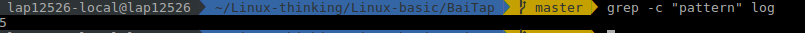
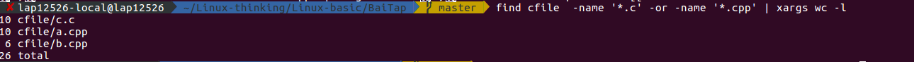
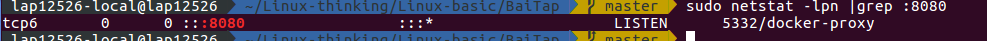
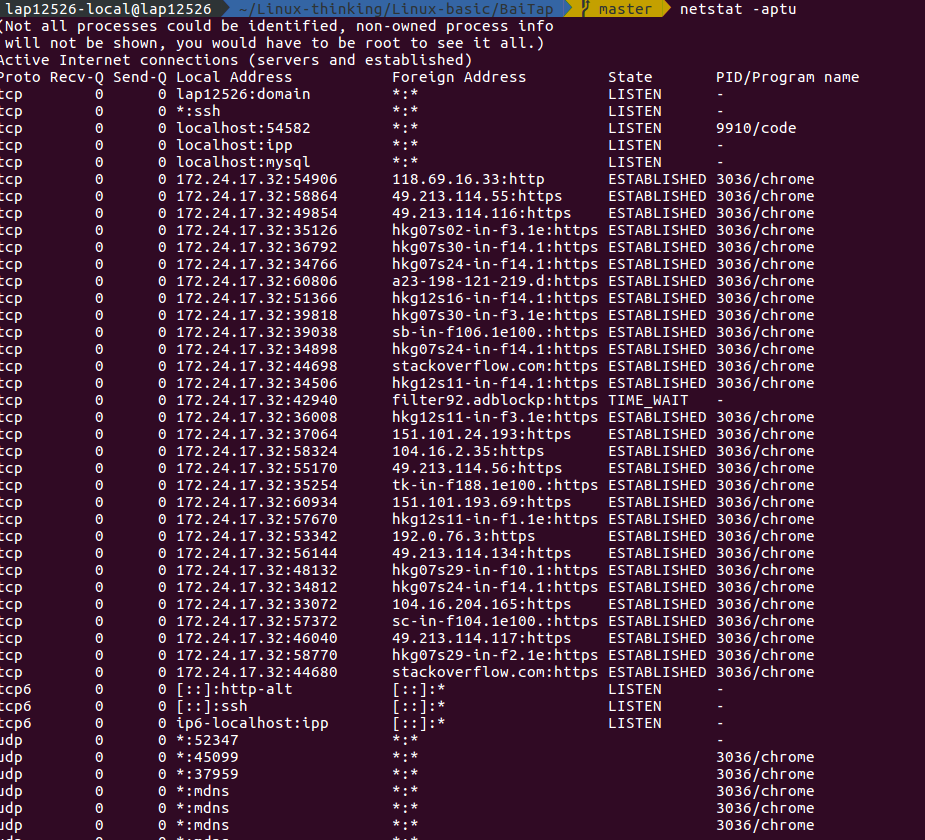
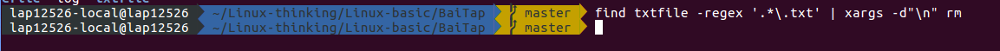

# Linux Basic
## 1. Một sô câu lệnh cơ bản trong linux
### 1.1 ls - List
    ls  liệt kê nội dung (file và thư mục) trong thư mục hiện hành. Nó cũng tương tự với việc bạn mở một thư mục và xem nội dung trong đó trên giao diện người dùng.

### 1.2 mkdir - Make Directory
    mkdir <tên thư mục mới>  tạo một thư mục mới. Nó cũng tương tự với việc bạn chọn new/create directory để tạo một thư mục mới trên giao diện người dùng.

### 1.3 pwd - Print Working Directory
    pwd  in ra đường dẫn đầy đủ đến thư mục hiện hành.    

### 1.4 cd - Change Directory
    cd <thư mục>  chuyển một thư mục thành thư mục hiện hành cho phiên làm việc hiện tại. Nó cũng tương tự với việc bạn mở một thư mục và thao tác với các file và thư mục bên trong đó trên giao diện người dùng.

### 1.5 rmdir - Remove Directory
    rmdir <thư mục>  xóa một thư mục.

### 1.6 rm - Remove
    rm <tên file>  xóa file. Bạn cũng có thể sử dụng  rm -r <tên thư mục>  để xóa thư mục và toàn bộ dữ liệu trong thư mục đó.

### 1.7 cp - Copy
    cp <file nguồn> <file đích>  sao chép file từ vị trí nguồn đến vị trí đích.
    Bạn cũng có thể sử dụng  cp -r <thư mục nguồn> <thư mục đích> để sao chép thư mục và toàn bộ dữ liệu bên trong.
 
### 1.8 mv - Move
    mv <nguồn> <đích>  di chuyển một file hoặc thư mục từ vị trí này sang vị trí khác. Lệnh này cũng dùng để đổi tên file hoặc thư mục nếu như  <nguồn>  và  <đích>  là cùng một thư mục.

### 1.9 cat – concatenate and print files
    cat <tên file>  đọc và in ra nội dung của file ra màn hình.

### 1.10 tail – print TAIL
    tail <tên file>  đọc và in ra nội dung 10 dòng cuối cùng của file (mặc định).
    Bạn có thể sử dụng  tail -n N <tên file>  để chỉ định in  N  dòng ra màn hình.

### 1.11 less – print LESS
    less <tên file>  in ra nội dung của một file theo từng trang trong trường hợp nội dung của file quá lớn và phải đọc theo trang. Bạn có thể dùng Ctrl+F để chuyển trang tiếp theo và Ctrl+B để chuyển về trang trước.

### 1.12 grep
    grep <chuỗi> <tên file>  tìm kiếm nội dung của file theo chuỗi cung cấp.
    Bạn có thể dùng  grep -i <chuỗi> <tên file>  để tìm kiếm không phân biệt hoa thường hoặc  grep -r <chuỗi> <tên thư mục>  để tìm kiếm trong toàn thư mục

### 1.13 find
     find <thư mục> -name <tên file>  tìm kiếm file trong  <thư mục>  theo  <tên file> .
    Bạn cũng có thể dùng find <thư mục> -iname <tên file>  để tìm kiếm không phân biệt hoa thường.

### 1.14 tar
    tar -cvf <tên-file-nén.tar> <file1 hoặc file2 ...>  tạo file nén (.tar) từ các file có sẵn. 

    tar -tvf <tên-file-nén.tar>  xem nội dung file nén (.tar).  

    tar -xvf <tên-file-nén.tar>  giải nén (file .tar).

### 1.15 gzip
    gzip <tên file>  tạo file nén (.gz). Sử dụng  gzip -d <tên file>  để giải nén (file .gz).

### 1.16 unzip
    unzip <file-nén.zip>  giải nén một file nén (.zip). Sử dụng  unzip -l <file-nén.zip>  để xem nội dung file zip mà không cần giải nén.

### 1.17 help
    <câu lệnh> --help  xem thông tin trợ giúp và các tùy chỉnh của câu lệnh.
    Có thể viết tắt là  <câu lệnh> -h 

### 1.18 whatis – What is this command
    whatis <tên câu lệnh>  hiển thị mô tả về câu lệnh.

### 1.19 man – Manual
    man <tên câu lệnh> ​ hiển thị trang hướng dẫn cho câu lệnh.

### 1.20 exit
    exit ​ thoát khỏi phiên làm việc. Tương tự như việc thoát khỏi một ứng dụng trên giao diện người dùng.

### 1.21 ping
    ping <địa chỉ host> ​ ping một host từ xa (server) bằng cách gửi các gói tin đến host đó. Nó thường dùng để kiểm tra kết nối mạng đến server.

### 1.22 who – Who Is logged in
    who ​ hiển thị danh sách các tài khoản đang đăng nhập vào hệ thống.

### 1.23 su – Switch User
    su <tên tài khoản> ​ chuyển sang đăng nhập bằng một tài khoản khác. Tài khoản root có thể chuyển sang đăng nhập bằng các tài khoản khác mà không cần nhập mật khẩu.

### 1.24 uname
    uname ​ hiển thị ra một số thông tin hệ thống như tên kernel, tên host, bộ xử lý, ...
    Bạn có thể dùng lệnh  uname -a ​ để hiển thị tất cả thông tin.

### 1.25 free – Free memory
    free ​ xem thông tin về bộ nhớ: bộ nhớ đã sử dụng, bộ nhớ còn trống trên hệ thống
    Bạn có thể dùng lệnh  free -m ​ để xem bộ nhớ với đơn vị KBs hoặc  free -g ​ để xem với đơn vị GBs

### 1.26 df – Disk space Free
    df ​ xem thông tin về dung lượng đĩa cứng (đã sử dụng, còn trống, ...) và các thiết bị lưu trữ khác.
    Bạn có thể dùng lệnh  df -h ​ để xem thông tin dưới dạng human readable (hiển thị với đơn vị KBs, GBs cho dễ đọc)
    
### 1.27 ps – Processes
    ps ​ hiển thị thông tin về các tiến trình đang chạy.
    

### 1.28 top – Top processes
    top ​ hiển thị thông tin về các tiến trình đang chạy, sắp xếp theo hiệu suất CPU.
    Bạn cũng có thể dùng lệnh  top -u <tài khoản> ​ để xem thông tin các tiến trình đang chạy của tài khoản đó.

### 1.29 shutdown
    shutdown ​ lệnh tắt máy tính. Có thể dùng  shutdown -r  để khởi động lại máy tính.

### 1.30 sed
    sed -e "s/keyword1/keyword2/" file.txt
    Dùng để tìm là thay thế từ trong file. Thêm -i để lưu giá trị mới vào file
 
### 1.31 awk
    Ở mức cơ bản thì awk dùng để  filter dữ liệu.
    BEGIN {Actions}
    {Action} # Action for every line in a file
    END {Actions}
    awk '{print $2, $5;}' test.txt # in ra cột thứ 2 và 5
    awk '$1 > 200' test.txt # in ra những dòng có cột 1 >200

### 1.32 xargs
    Ở mức cơ bản là format dữ liệu.
    cat example.txt | xargs  # Sẽ sắp xêp dữ liệu thành 1 hàng
    cat example.txt | xargs -n 3 # Mỗi hàng 3 cột
    echo "splitXsplitXsplitXsplit" | xargs -d X # Chuyển X thành khoảng trắng

### 1.33. chmod
    Set permissions
    “Read” (Đọc): viết tắt là “r”, và được biểu diễn bằng số 4
    “Write” (Ghi / Chỉnh sửa): viết tắt là “w”, và được biểu diễn bằng số 2
    “Execute” (Thực thi): viết tắt là “x”, và được biểu diễn bằng số 1
    “Owner” – chủ sở hữu của file/thư mục
    “Group” – Nhóm mà Owner là thành viên
    “Public / Others/ Everybody”: những người còn lại

ex: 
```
chmod 777 participants
```

- [Basic command](https://techmaster.vn/posts/33520/cau-lenh-linux-ban-can-biet-2)

## 2.Bài tâp

### 2.1 Processing texts

- Count the number of lines satisfying a specific pattern in a log file

Syntax:
```
grep -c "pattern" filename
```

ví dụ:

<div>
    
 </div>

- Calculate KLOC of code C/C++ files in a directory

```
find <folder>  -name '*.c' -or -name '*.cpp' | xargs wc -l 
```

Ví dụ:

<div>
    
 </div>

### 2.2 System

- Kill multiple processes following a patterns (using awk, grep, xargs)

```
ps -e | grep -i <pattern> | grep -v grep | awk '{print $1}' | xargs -r kill -9
```

vi dụ:

```
ps -e | grep -i python | grep -v grep | awk '{print $1}' | xargs -r kill -9
```

- Kill processes opening a specific port (using netstat, grep...)
```
sudo netstat -lpn |grep : <port> 
kill -9 <pid>
```

<div>
    
 </div>

5332 là pid

- List opennned ports, handles

```
sudo netstat -aptu
```
<div>
    
 </div>

    First column is protocol

    Forth column local address includes local IP, port, service

    Fifth column destination IP, port etc

    Sixth column is current state

    Last column is PID and process name which owns that socket


- Find files via regular expressions, and remove them

```
find <directory> -regex <pattern> | xargs -d"\n" rm
```

ví dụ

<div>
    
 </div>

- List, one at a time, all files larger than 100K in the /home/username directory tree. Give the user the option to delete or compress the file, then proceed to show the next one. Write to a logfile the names of all deleted files and the deletion times.

```sh
#!/bin/bash

_dir_file = $HOME/Linux-thinking/Linux-basic/BaiTap/
printf "\nList file > 100k: \n"
find $_dir_file  -type f -size +100k | xargs -n 1

printf "\nPlease choose a option:\n"
printf "1 - Delete\n"
printf "2 - Compress\n"


read option

if [ $option = 1 ]; then

    # Ghi log va xoa file
    echo "[Time: $(date)]\nList file remove: \n" >> $HOME/Linux-thinking/Linux-basic/BaiTap/logfile
    find $_dir_file -type f -size +100k >> $HOME/Linux-thinking/Linux-basic/BaiTap/logfile

    find $_dir_file -type f -size +100k | xargs -d"\n" rm
    printf "Deleted successful.\n"
elif [ $option = 2 ]; then

    find $_dir_file -type f -size +100k -print0 | sudo tar -czvf $HOME/Linux-thinking/Linux-basic/BaiTap/compress.tar.gz -T -
    printf "Compressed successful.\n"
else
    printf "Invalid selection.\n"
fi
```
 