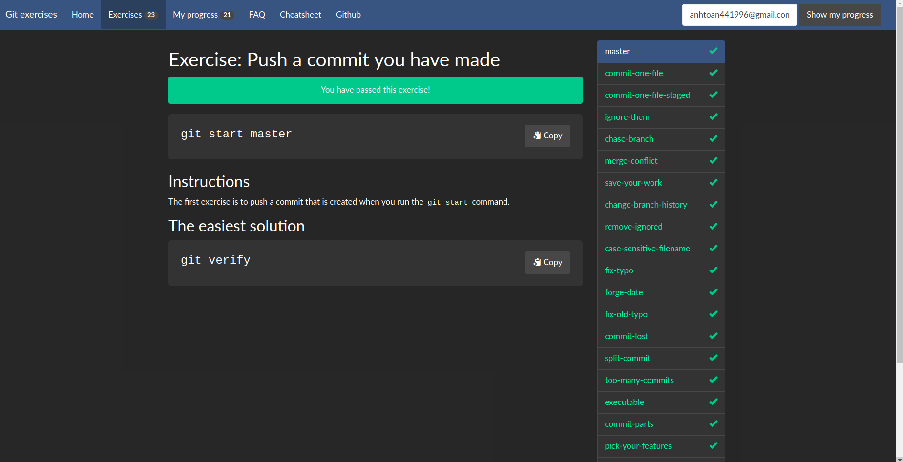

# SOURCE CONTROL

## 1. Lý thuyết

- add các file và folder có thay đổi

```git
 git add . # add tất cả file thay đổi.
 git add <ten file> #add file theo chỉ đinh.
```

- commit các thay đổi đã add

```
git commit -m "<message>"
```

- Push: push commit lên repo

```
git push
```

- Pull những thay đổi của repo xuống local

```
git pull
```

- merge: merge những thay đổi của 1 nhánh chỉ định vào nhánh hiện tại

```
git merge <branch>
```

- Tạo branch

```
 git checkout -b <branch-name-new>
```

- check out: dùng để chuyển đổi branch

```
git checkout <branch>
```

- stash: dùng để lưu sự thay đổi hiện thời mà không commit

```
git stash #dung de luu thay doi truoc pull
git stash pop #dung de lay lai su thay doi tu stash
```

## 2. Bài tập 

Email: anhtoan441996@gmail.com

<div>
    
</div>